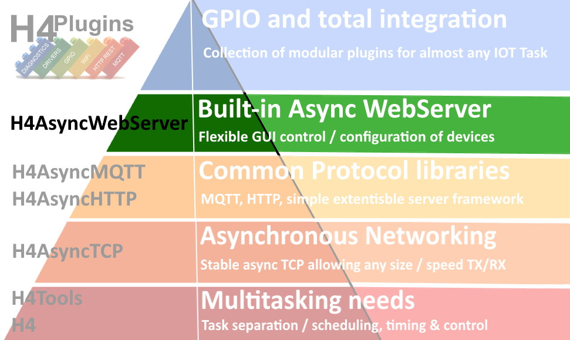
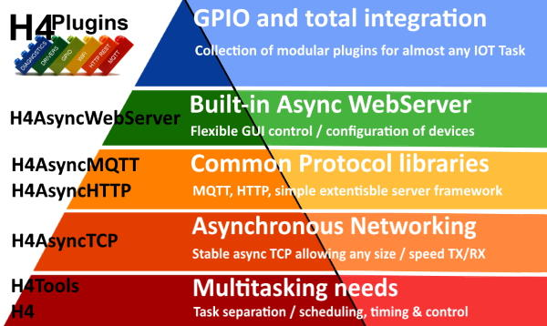
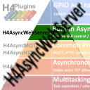

# H4AsyncWebServer

# Asynchronous Webserver for ESP8266, ESP32

Includes robust and *fast* implementations of websockets and server-sent events (SSE)

---

## Version 0.0.1 19/10/2021 - SHOULD BE CONSIDERED ALPHA

Contains minimal functionality to support H4 projects: anything you need adding for more general-purpose apps, just ask (see end of page for contact details)

---

Licence:  Creative Commons: Attribution-NonCommercial-ShareAlike 4.0 International (CC BY-NC-SA 4.0) [Legal Text](https://creativecommons.org/licenses/by-nc-sa/4.0/legalcode)

# ***N.B. This licence expressly prohibits commercial use***

---

## If you are able, please [Support me on Patreon](https://patreon.com/esparto) and/or subscribe to my [Youtube channel (instructional videos)](https://www.youtube.com/channel/UCYi-Ko76_3p9hBUtleZRY6g)

---

# Contents

* [What does it do? (*and importantly...NOT do)](#what-does-it-do)
* [Where does it fit in "The IOT hierarchy of needs"?](#the-iot-hierarchy-of-needs)
* [Prerequisites](#prerequisites)
* [Installation](#installation)
* [Raising Issues](#issues)
* [API](#api)

---

# What does it do?

It's an asynchronous webserver for ESP8266 and ESP32 supporting websockets and SSE, but first let us deal with what it does *not* do...

***H4AsyncWebServer is NOT a "drop-in" replacement for ESPAsyncWebServer***

It is almost impossible to discuss `H4AsyncWebServer` without reference to the `ESPAsyncWebServer` library, but I shall keep it to the bare minimum. `H4AsyncWebServer` only exists because of the serious bugs, faulty / broken implementations of SSE, websockets and nigh-on total lack of support in `ESPAsyncWebServer`. 


`H4AsyncWebServer` was written specifically to workaround these long-standing unresolved major issues in `ESPAsyncWebServer` that contribute to the instability of any ESP app using it and its subsequent total lack of suitability for use in robust apps.

## Main reason for differences

* Several of the API / interfaces  in `ESPAsyncWebServer` exhibit one or more of these traits:
  * Illogical: e.g. provide redundant data items that are never needed and/or meaningless to the user
  * Use incorrect data types: e.g. make fatal assumptions that data items are C-style strings when they are not.
  * At the wrong "level": expose functions / data types to the user that should be used *only* internally by the library
  * Suggest fundamental misunderstanding of the underlying protocol's purpose / function

* `H4AsyncWebServer`'s primary goal was to support the H4 "family" of apps, so only features that are required by those other H4 libraries are present

Some authors may take the view that propagating the illogical/incorrect/wrong-level/broken API to a replacement libary is a "GOOD THING" to reduce user refactoring etc and make direct "drop-in" possible. This author is not one of those, thus you will need to make many changes to any existing codebase if you want to replace `ESPAsyncWebServer` with `H4AsyncWebServer`. (*But at least it might not then crash quite as often* :smile: )

Any "missing" feature can be added easily enough if a user can make a solid case for it and this author is happy to add whatever other features make the library more applicable outside the H4 family.

---

# The "IOT Hierarchy of needs"



|| Name | Provides | Notes |
| :---: | :----------  | :--- | :--- |
||[H4](https://github.com/philbowles/H4)|Scheduler/Async Timers - core of all multitasking functions| |
||[H4Tools](https://github.com/philbowles/H4Tools)|'32/'8266 HAL and utility functions| |
||[H4AsyncTCP](https://github.com/philbowles/H4AsyncTCP)| Asynchronous TCP RX/TX| |
||[H4AsyncMQTT](https://github.com/philbowles/H4AsyncMQTT)| Asynchronous MQTT c/w auto-reconnect and *full* QoS0/1/2 | |
||[H4AsyncHTTP](https://github.com/philbowles/H4AsyncHTTP)| Asynchronous remote GET / POST etc | |
||[H4AsyncWebServer](https://github.com/philbowles/H4AsyncWebServer)| Asynchronous Web Server + fast webSockets + SSE| :point_left: *YOU ARE HERE* |
||[H4Plugins](https://github.com/philbowles/H4Plugins)| Fully-featured IOT Apps multitasking framework| |

---

# Prerequisites

The library has been tested using the following firmware. Please do not even *think* about raising anhy issues unless you have the following correctly installed.

* [ESP8266 core 3.0.2](https://github.com/esp8266/Arduino)
* [ESP32 core 2.0.0](https://github.com/espressif/arduino-esp32)
* [ArduinoIDE 1.8.16](https://www.arduino.cc/en/software)

***N.B.***

Note that PlatformIO is not in the above list. Many folk *do* use it, but you will need to create your own installation configuration.
I am currently in discussions to add a PIO install to the standard [H4 Installer](https://github.com/philbowles/h4installer). If you are able to help / contribute to this, please get in touch!

---

# Installation

Soon* all H4 libraries will use the [H4 Installer](https://github.com/philbowles/h4installer). This ensures that all versions match and that other additional special functions are included e.g. Addition of optimised board definitions in H4Plugins...

...Until that's ready, install this library manually by downloading the zip file and using the ArduinoIDE to "add zip library". (Luckily, it has no extra tasks that would require the full H4 installer)

* = Don't ask :) 

---

# Issues

## If you want a *quick* resolution, please follow these rules:

1. As with all H4xxx libraries, please make sure you have read *all* the relevant documentation relating to the issue and watched any videos on the [Youtube channel (instructional videos)](https://www.youtube.com/channel/UCYi-Ko76_3p9hBUtleZRY6g). Please also subscribe to the channel for notifications of news and updates.

2. If you still think there is a problem, then join the [Facebook H4  Support / Discussion](https://www.facebook.com/groups/444344099599131/) group and report the issue *briefly* there. This is because I visit the group every day, whereas I do not have time to visit dozens of github repos every day. Furthermore, it alerts other users to potential problems and allows a rapid initial assessment. 

3. If there is a genuine issue then you will be referred to [Raising H4/H4Plugins issues](https://github.com/philbowles/h4plugins/blob/master/docs/issues.md) after which you are advised to create a full github issue report.

4. Failing to make an initial report in the [Facebook H4  Support / Discussion](https://www.facebook.com/groups/444344099599131/) group and simply starting with a github issue, or failing to include all of the information required in [Raising H4/H4Plugins issues](https://github.com/philbowles/h4plugins/blob/master/docs/issues.md) is likely to result in a ***long*** delay before it gets picked up.

---

# API

## Introduction

The basic usage model is as follows:

* Declare / instantiate a server at global scope
* In `h4setup` add "handlers" to the server in order that they should be applied to each incoming request
* `begin()` the server once WiFi has connected (or reconnected!)

The main body of work in setting up your server will be in the choice, order and content of the handlers: before the API proper we will "walk-through" some examples. If you have used other servers e.g. NodeJS/Express think of a handler as a 'route'.

Before running the app you will need to upload all your web assets e.g. html, js, css, img files from the `data` folder to the FS which will be:

* On ESP8266: LittleFS
* On ESP32: SPIFFS

...having made sure you have sized the FS partition sufficiently to hold all of those assets!

### Declare / instantiate a server at global scope

```cpp
#include<H4AsyncWebServer.h>

H4AsyncWebServer srv1(80); // listen on port 80
H4AsyncWebServer srv2(8080); // listen on port 8080

```

You may have as many servers within the one app as your CPU / memory / stack limits will allow,
as long as each listens on a different port. See the ["full house" example sketch](examples/full_house/full_house.ino) which runs 4 different servers at the same time, only *one* of which is actually an HTTP webserver!

```cpp
#include<H4AsyncWebServer.h>
#include<DiscardServer.h>
#include<EchoServer.h> // can test with client.py
#include<RandomQuoteServer.h>

H4AsyncWebServer s(80);
DiscardServer devnul(8009);
EchoServer gecko(8007);
RandomQuoteServer rqs(8017);

```

### Handlers ("routes")

#### The general form of a handler is: 

* A path, e.g. "/" (the root/home/index)
* An HTTP "verb" or access method, e.g. HTTP_GET, HTTP_POST, HTTP_PUT
* A function which then takes action ("handles") any matching request

The handler function is passed a pointer to an internal object (`H4AW_HTTPHandler`) which has methods and properties that allow you to get information about the request and build / send a reply to that request.

Not forgetting that you will be using [H4](https://github.com/philbowles/H4) which has no `setup` or `loop` function, the simplest webserver one can write would look something like this:

```cpp
void h4setup(){
  HAL_FS.begin(); // ESP32 cannot call this from constructor, so... mimic H4Plugins :)  
  // connect to WiFi....
  s.on("/",HTTP_GET,[](H4AW_HTTPHandler* h){
    h->sendFile("/index.htm");
  });
  
  s.begin();
}
```

Some other servers require that you explicitly declare handlers for "static" files such as dependent .js , .css files etc and they often also require a specific "not found" (or "404") handler. `H4AsyncWebServer` includes these automatically for you. Your code actually behaves like this:

```cpp
void h4setup(){
  HAL_FS.begin(); // ESP32 cannot call this from constructor, so... mimic H4Plugins :)  
  // connect to WiFi....
  s.on("/",HTTP_GET,[](H4AW_HTTPHandler* h){
    h->sendFile("/index.htm");
  });
  // IMPLICIT STATIC HANDLER - will only get here if all other paths above have failed to match
  // treat path as full filename of a file in FS
  // if file exists, serve file with correctly set MIME type and cache-age of H4AW_CACHE_AGE (see h4asws_config.h)
  //
  // IMPLICIT 404 HANDLER - will only get here if all other paths above have failed to match
  // reply HTTP 404 error
  s.begin();
}
```

#### Handler processing rules

* Handlers are examined for a possible match with path/verb in order of declaration ***from top to bottom***
* Matches occur in "startswith" style: A handler of "/rest" will match against incoming urls of e.g.
  * /rest/add/123/new data
  * /rest/delete/123
  * /restaurant/at/the/end/of/the/universe
  * /rest.js
* Once a handler function has been called on a match, ***no further handlers will be called***
* Handler functions must send *some* form of reply, or the user will be staring at an egg-timer till he dies.

Given the nature of the "startswith" path matching, two important points arise:

* Choose the path name wisely and avoid having any static files which start the same: Having your function deal with the contents of `rest.js` in the above example is almost certainly *not* what you want
* If you wish to implement a "multilevel" url structure (as in the first two examples above) then parsing of the full url and any subsequent routing is a matter for your code within the handler function: the library offers no features for any further "sub-routing"

## H4AsyncWebServer API

```cpp
// callbacks
void myHandlerFunction(H4AW_HTTPHandler*)
// constructor
H4AsyncWebServer(uint16_t port,size_t cacheAge=H4AW_CACHE_AGE);
//

void addHandler(H4AW_HTTPHandler* h); // add handler(e.g. websocket / SSE) into the routing chain
void begin();
void on(const char* path,int http_verb,H4AW_RQ_HANDLER myHandlerFunction);
void reset(); // remove all handlers, return to power-on state

```

## H4AW_HTTPHandler API

```cpp
// NB constructor is never called by the user
void addHeader(const std::string& name,const std::string& value) // adds HTTP header to reply before calling sendXXXX
uint8_t* bodyData() // address of input request raw body data (if any)
size_t bodySize() // length of input request raw body data
H4AW_HTTPRequest* client() // ptr to original request (base is H4AsyncClient) allows access to remoteIP() etc of client
std::string mimeType(const char* fn); // returns mime type of file / file extention e.g. fn can be "myfile.xyz" or just "xyz"
H4T_NVP_MAP& params()// name/value pair map of input parameters either from ? query string or POST body
void redirect(const char* url); // Send HTTP 303 redirect to new url
void reset(); // should not be called by user
// code = HTTP code
// type =MIME type of reply: either type returned from mimeType or literal e.g. "text/plain"
// length of body data
// _body = address of body data
void send(uint16_t code,const std::string& type,size_t length=0,const void* _body=nullptr);
void sendFile(const char* fn) // server file from FS
void sendFileParams(const char* fn,H4T_FN_LOOKUP f);
void sendOK(); // reurn HTTP 200 OK
void sendstring(const std::string& type,const std::string& data){ send(200,type,data.size(),(const void*) data.data()); }
std::string url(); // returns full URL of request
```

## H4AW_HTTPHandlerWS (websocket) API

This is not a full implementation: sub-protocols are not supported

```cpp
// callbacks
// H4AW_HTTPRequest* skt is a pointer to the raw websocket object
void mySocketOpen(H4AW_HTTPRequest* skt);
void mySocketClose(H4AW_HTTPRequest* skt);
void mySocketTextMessageReceived(H4AW_HTTPRequest* skt,const std::string& msg);
void mySocketBinaryMessageReceived(H4AW_HTTPRequest*,const uint8_t* data,size_t length);
//
// constructor
H4AW_HTTPHandlerWS(const std::string& url); // url=path used inside javascript websocket, e.g. "/ws" or "/mysocket"
//
void broadcastBinary(const uint8_t* data,size_t len); // send binary websocket msg to all clients
template<typename... Args>
void broadcastText(const char* fmt, Args... args); // printf-style format,a,b,c... etc text message to all clients
void onBinaryMessage(H4AW_FN_WSBIN mySocketBinaryMessageReceived); // define binary socket message RX handler
void onClose(H4AW_FN_WSEVENT mySocketClose); // define socket client gone away handler
 void onOpen(H4AW_FN_WSEVENT mySocketOpen); // define new socket client handler
 void onTextMessage(H4AW_FN_WSTXT cb); // define text socket message RX handler
 void reset() override; // don't call this!
 size_t size(); // returns number of socket clients
```

[Example sketch](examples/websocket_tester/websocket_tester.ino)

## H4AW_HTTPHandlerSSE (Server-Sent Events) API

```cpp
//callbacks
void newSocketClient(size_t n); // n = number of SSE clients
// constructor
// url=path used inside javascript websocket, e.g. "/event" or "/sse"
// backlog = number of messages to keep (cyclic buffer of last n) for retransmission after client reconnect
H4AW_HTTPHandlerSSE(const std::string& url,size_t backlog=0);
//
void onConnect(H4AW_EVT_HANDLER cb){ _cbConnect=cb; }
void reset() override; // dont call this
void saveBacklog(const std::string& msg); // dont call this
void send(const std::string& message, const std::string& event="");
size_t size(); // returns number of  SSE clients
```

[Example sketch](examples/sse_tester/sse_tester.ino)

---

(c) 2021 Phil Bowles h4plugins@gmail.com

* [Support me on Patreon](https://patreon.com/esparto)
* [Youtube channel (instructional videos)](https://www.youtube.com/channel/UCYi-Ko76_3p9hBUtleZRY6g)
* [Facebook H4  Support / Discussion](https://www.facebook.com/groups/444344099599131/)
* [Facebook General ESP8266 / ESP32](https://www.facebook.com/groups/2125820374390340/)
* [Facebook ESP8266 Programming Questions](https://www.facebook.com/groups/esp8266questions/)
* [Facebook ESP Developers (moderator)](https://www.facebook.com/groups/ESP8266/)